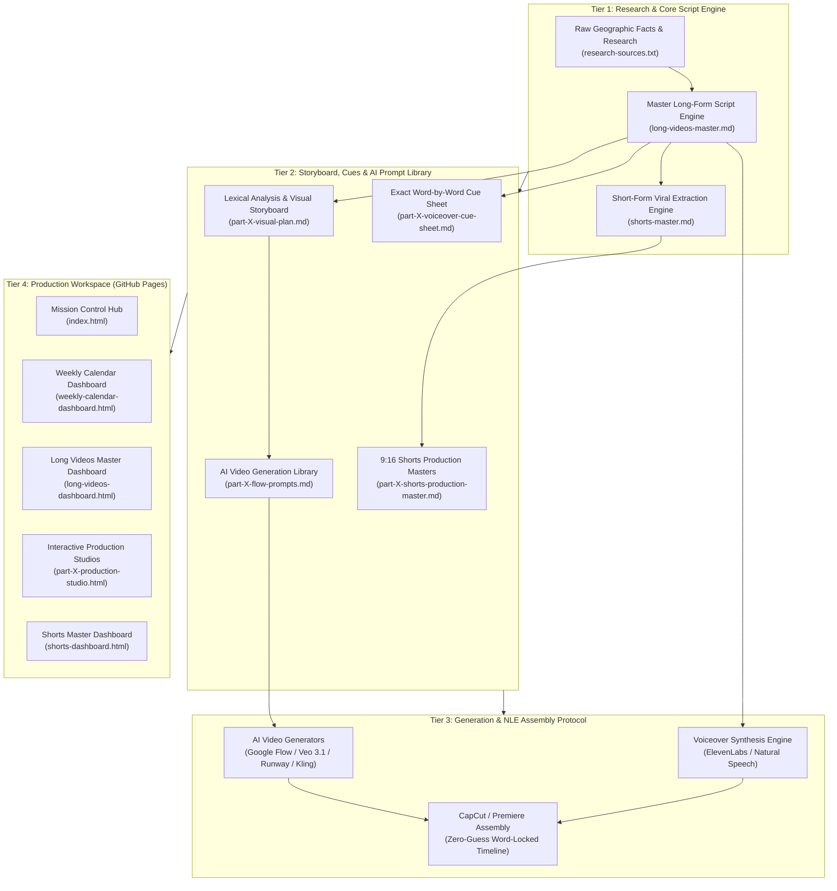
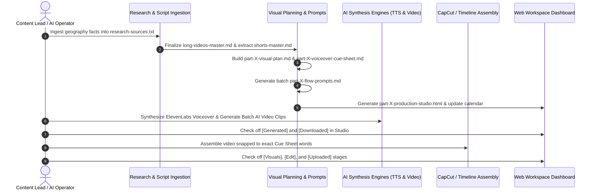

# Geography YouTube Channel Framework & Production Architecture Blueprint
**Complete Universal Skeleton, Automation Architecture, and Execution Engine for Faceless AI-Powered Geography Channel**

---

## 1. Executive System Architecture

This blueprint documents the complete architectural skeleton and production pipeline extracted from the reference multi-part content engine. It adapts the system into a high-retention, faceless **Geography YouTube Channel framework**.

The architecture decouples the production into 4 interoperable tiers:
1. **Research, Scripting & Multi-Format Extraction**: High-density documentary scripts paired with 3x modular short-form viral extractions per episode.
2. **Deterministic Visual Cue & Storyboard Engine**: Micro-timed phrase anchors ("Switch immediately after") removing all visual synchronization ambiguity during timeline assembly.
3. **Structured AI Video Prompt Generation**: Parameterized scene formulas with strict aesthetic constraints, negative prompts, and consistency guardrails.
4. **Interactive Static Web Workspace (GitHub Pages)**: Zero-backend, real-time reactive dashboards with `localStorage` state persistence, multi-tab sync, one-click asset copying, and responsive drawer navigation.



---

## 2. Complete File & Directory Tree Specification

Every file in the Geography Channel repository serves a distinct operational purpose within the production lifecycle:

```text
/opt/projects/geography/
├── .nojekyll                               # Disables Jekyll processing on GitHub Pages
├── index.html                              # Central Mission Control Hub & series-wide progress overview
├── research-sources.txt                    # Raw geopolitical research, geographic datasets, climate records
├── master-script-archive.txt               # Central verbatim text repository
│
└── content-plan/
    ├── 01-visual-style-guide.md            # Master visual language, color tokens, and prompt guardrails
    │
    ├── weekly-calendar/
    │   ├── weekly-calendar.md              # Publishing cadence & 5-stage markdown tracking matrix
    │   └── weekly-calendar-dashboard.html  # Interactive weekly release schedule dashboard
    │
    ├── long-videos/
    │   ├── long-videos-master.md           # Master documentary episode syllabus & verbatim scripts
    │   ├── long-videos-dashboard.html      # Master Long Videos tracking dashboard
    │   │
    │   ├── part-1/                         # Episode 01 Production Hub
    │   │   ├── index.html                  # Clean route redirect
    │   │   ├── part-1-dashboard.html       # Focused clip tracking dashboard
    │   │   ├── part-1-production-studio.html # Full interactive studio (Script, Cues, Prompts, Status)
    │   │   ├── part-1-visual-plan.md       # Lexical frequency analysis & visual storyboard
    │   │   ├── part-1-flow-prompts.md      # AI video prompt library with credit calculations
    │   │   └── part-1-voiceover-cue-sheet.md # Word-by-word visual switch cue sheet
    │   │
    │   ├── part-2/
    │   │   ├── index.html
    │   │   ├── production-studio.html
    │   │   ├── part-2-visual-plan.md
    │   │   ├── part-2-flow-prompts.md
    │   │   └── part-2-voiceover-cue-sheet.md
    │   │
    │   └── part-N/                         # Modular & infinitely scalable to N parts
    │       ├── index.html
    │       └── production-studio.html
    │
    └── shorts/
        ├── shorts-master.md                # Master Shorts syllabus (3x extracts per documentary)
        ├── shorts-dashboard.html           # Master Shorts tracking dashboard
        │
        ├── part-1/                         # Episode 01 Shorts Portfolio (Short A, B, C)
        │   ├── index.html                  # Clean route
        │   ├── studio.html                 # Interactive 9:16 Shorts Studio
        │   └── part-1-shorts-production-master.md # 9:16 cue maps & safe-area storyboard
        │
        ├── part-2/
        │   ├── index.html
        │   ├── studio.html
        │   └── part-2-shorts-production-master.md
        │
        └── part-N/
            ├── index.html
            └── studio.html
```

---

## 3. Standardized Markdown Document Schemas

All documentation follows strict schemas to allow automated generation, parsing, and execution.

### 3.1. Master Visual Style Guide (`01-visual-style-guide.md`)
Defines the visual rules, color palettes, camera dynamics, faceless subject rules, prohibited elements, and the mandatory AI prompt suffix.

```markdown
# Visual Style Guide — [Channel / Series Name]

## 1. Master Style Definition
**[Primary Style: e.g., 8K Ultra-Photorealistic Geography Documentary / Cinematic Topographic Realism]**

## 2. Core Aesthetic Description
[3-4 sentences detailing lighting, atmospheric depth, geological textures, scale, elevation modeling, and filmic grain.]

## 3. Color Palette & Atmospheric Lighting
- Primary Palette: Deep Oceanic Navy (`#0A192F`), Basalt Mountain Charcoal (`#1B2421`), Tectonic Ochre (`#D4AF37`)
- Environmental Accents: Glacial Cyan (`#78D0AA`), Savannah Emerald (`#176047`), Sunset Amber (`#EFD57B`)
- Lighting Style: Volumetric morning mist, golden-hour raking light highlighting terrain relief, high-altitude atmospheric glow.

## 4. Camera Dynamics & Motion Mechanics
- Pacing: Continuous, smooth, meditative cinematic drone / orbital movement (24 fps).
- Motion Vectors: Slow push-ins toward landforms, lateral mountain pans, descending aerial top-down reveals.
- NO rapid whip pans, shaky-cam, or abrupt action cuts.

## 5. Composition & Geographic Scale Rules
- Scale Juxtaposition: Small exploration vessel or solitary researcher silhouette against massive tectonic rift / towering fjord.
- Rule of Thirds: Place horizon line strictly on lower or upper third; geographic focal points offset.
- Depth Planes: Layered foreground terrain, midground landform/waterway, atmospheric background sky/haze.

## 6. Subject Depiction Rules (Faceless Protocol)
- Distant silhouettes, back-facing explorers, aerial birds-eye perspectives, or partial hands over maps/instruments only.
- ZERO close-up facial features or recognizable human faces.
- ZERO synthetic text or distorted geographic labels generated inside raw AI clips (all typography is added in post-production).

## 7. Prohibited Elements (Zero Tolerance Guardrails)
- NO photorealistic human faces or talking-head interviews.
- NO AI-generated gibberish text, fake maps with scrambled country names, or artificial watermarks.
- NO modern commercial clutter, plastic trash, or neon branding (unless relevant to specific urban geography).
- NO embedded audio, music, voiceover, or SFX inside raw video clips.

## 8. Mandatory End Line for EVERY AI Prompt
"8k resolution, cinematic geography documentary cinematography, photorealistic topographic depth, natural atmospheric haze, volumetric sunlight, 35mm film grain, hyper-detailed terrain texture, slow steady drone motion. Silent scene, no audio, no music, no voice, no dialogue, no text overlays, no watermarks."

## 9. Parameterized Prompt Formula
[BIOME / GEOGRAPHIC SETTING] + [SPECIFIC PHYSICAL PHENOMENON] + [SCALE ANCHOR / SUBJECT] + [LIGHTING & ATMOSPHERE] + [CAMERA MOTION VECTOR] + [MANDATORY END LINE]
```

---

### 3.2. Master Weekly Calendar (`weekly-calendar.md`)
Maintains the release schedule and 5-stage production status matrix for all assets.

```markdown
# Weekly Upload Calendar — [Series Name]

## Overview
- Structure: [N] Documentary Episodes + [3*N] Shorts = [4*N] Total Video Assets
- Publishing Schedule: [N] Weeks
- Weekly Cadence: 1 Long Video (Monday) + 3 Shorts (Wednesday, Friday, Sunday)

## Weekly Content Schedule Grid

| Week | Monday — Long Documentary | Wednesday — Short A | Friday — Short B | Sunday — Short C |
|:---:|---|---|---|---|
| 1 | Part 1: [Episode Title] | [Short A: The Enigma Hook] | [Short B: The Data Shock] | [Short C: The Future Shift] |
| 2 | Part 2: [Episode Title] | [Short A Title] | [Short B Title] | [Short C Title] |
| ... | ... | ... | ... | ... |

## 5-Stage Production Status Matrix

| # | Wk | Format | Video Title | Script | Voiceover | AI Visuals | Video Edit | Uploaded |
|---:|:---:|:---:|---|:---:|:---:|:---:|:---:|:---:|
| 1 | 1 | Long | Part 1: [Title] | [ ] | [ ] | [ ] | [ ] | [ ] |
| 2 | 1 | Short A | Short A: [Title] | [ ] | [ ] | [ ] | [ ] | [ ] |
| 3 | 1 | Short B | Short B: [Title] | [ ] | [ ] | [ ] | [ ] | [ ] |
| 4 | 1 | Short C | Short C: [Title] | [ ] | [ ] | [ ] | [ ] | [ ] |
| 5 | 2 | Long | Part 2: [Title] | [ ] | [ ] | [ ] | [ ] | [ ] |
```

---

### 3.3. Long Videos Master Syllabus (`long-videos-master.md`)
Defines the full series outline and locked verbatim scripts for long-form episodes.

```markdown
# Long Videos — [Series Title] Master Plan

## Overview
- Total Episodes: [N]
- Total Series Duration: ~[M] minutes
- Total Word Count: ~[W] words (calculated at 150 words/minute voiceover rate)
- Target Video Format: 16:9 4K Landscape

## Series Episode Catalog

| Week | Part | Title | Est. Duration | Word Count | Geographic Focus |
|:---:|:---:|---|:---:|:---:|---|
| 1 | Part 1 | [e.g., The Great Rift: Africa's New Ocean] | 7.5 min | 1,125 words | East African Tectonic Rift System |
| 2 | Part 2 | [e.g., The Dead Heart of Australia] | 6.5 min | 975 words | Outback Aridity & Great Dividing Range |

## Part-by-Part Verbatim Scripts

### Part 1 — [Title]
- Duration: [X.X] minutes
- Word Count: [Y] words
- Opening Hook Line: “[First 10 words]”
- Closing Outro Line: “[Last 10 words]”
- Core Educational Thesis: [1-2 sentences summarizing core geological/geographical concept]

**Full Verbatim Script:**
[Complete, paragraph-separated narrative text formatted for TTS audio generation]
```

---

### 3.4. Episode Visual Plan & Storyboard (`part-X-visual-plan.md`)
Breaks down the script into lexical themes, time-mapped narrative arcs, and ~20–25 distinct visual scenes.

```markdown
# Part [X]: [Episode Title] — Visual Plan & Storyboard

## 1. Lexical & Thematic Frequency Analysis
Quantifies core themes in the script to ensure balanced visual pacing:
- Terrain & Tectonics: Mentioned [N] times (Visuals: Fault lines, rift valleys, mountain ranges)
- Hydrology & Oceans: Mentioned [N] times (Visuals: River deltas, ocean trenches, glacial runoff)
- Climate & Atmosphere: Mentioned [N] times (Visuals: Desert dunes, monsoon clouds, thermal haze)
- Human Presence & Borders: Mentioned [N] times (Visuals: Distant outposts, lone explorers, high-altitude maps)

## 2. Narrative Flow Map (Time-Coded)
- 0:00–0:40 — Act 1: The Geographic Mystery / Initial Phenomenon Hook
- 0:40–2:10 — Act 2: Geological Origins & Physical Landscape Mechanics
- 2:10–4:30 — Act 3: Ecological, Demographical, and Territorial Impacts
- 4:30–6:00 — Act 4: The Future Transformation / Predictive Modeling
- 6:00–7:30 — Act 5: Global Significance & Closing Synthesis

## 3. Visual Scene List (~20–25 Scenes)

### Scene 01 (Approx. 0:00–0:18)
- Voiceover Context: “[Opening line of narrative]”
- Visual Concept: High-altitude orbital perspective descending toward [Landmark].
- Key Visual Elements: Earth curvature, morning terminator line, deep tectonic fractures.
- Motion Mechanics: Smooth linear push-down.
- Mood: Epic, scientific, contemplative.
- Asset Reusability: Reusable across Shorts and regional recaps.
```

---

### 3.5. Batch AI Video Generation Prompts (`part-X-flow-prompts.md`)
Formats all prompts for batch processing across AI video generators.

```markdown
# Part [X] — AI Video Generation Prompts (Hybrid Generation Engine)

## Generation Parameters & Credit Allocation
- Total Clips: [N] clips
- Credit Budget: [C] credits (Fast / Turbo mode)
- Static Ambient Scenes (1 clip per scene, slowed 50% in NLE): [S] scenes
- Dynamic Action Scenes (2 clips per scene for multi-angle coverage): [D] scenes
- File Naming Syntax: `p[Part]-s[Scene][Suffix].mp4` (e.g., `p1-s01.mp4`, `p1-s02-a.mp4`, `p1-s02-b.mp4`)

## Scene Prompt Catalog

### Scene 01 — [Scene Name]
**Type:** Static Ambient (1 clip) | **Credits:** 10 | **Target File:** `p1-s01.mp4`

```text
[Scene Prompt text adhering strictly to the parameterized formula and ending with the mandatory style suffix]
```

### Scene 02 — [Scene Name]
**Type:** Dynamic Action (2 clips) | **Credits:** 20 | **Target Files:** `p1-s02-a.mp4`, `p1-s02-b.mp4`

#### Clip A (Wide Perspective)
```text
[Prompt A text + Mandatory Suffix]
```

#### Clip B (Close Topographic / Macro Drift)
```text
[Prompt B text + Mandatory Suffix]
```
```

---

### 3.6. Authoritative Voiceover-to-Visual Cue Sheet (`part-X-voiceover-cue-sheet.md`)
Maps spoken words directly to clip transitions for timeline editors.

```markdown
# Part [X] — Exact Voiceover-to-Visual Cue Sheet

## CapCut / NLE Timeline Assembly Rules
1. Place the master synthesized Voiceover track on Track 1.
2. Generate Auto-Captions with word-level timing on Track 2.
3. Align Clip 1 (`p1-s01.mp4`) to the first spoken word at `0:00.0`.
4. Keep Clip 1 on screen until the exact **Switch immediately after** spoken phrase.
5. Place the next clip on the exact subsequent frame with zero black frames or gaps.
6. Spoken word triggers take absolute priority over estimated timecodes.

## Master Cue Transition Table

| Cut # | Scene / Clip | Target File | Word Range | Est. Timecode | Switch Immediately After Spoken Words |
|:---:|---|---|:---:|:---:|---|
| 01 | Scene 1 — Wide | `p1-s01.mp4` | 1–38 (38 words) | 0:00.0–0:15.2 | “...which will permanently change the world’s map.” |
| 02 | Scene 2 — Angle A | `p1-s02-a.mp4` | 39–62 (24 words) | 0:15.2–0:24.8 | “...beneath the desolate salt plains of the Danakil.” |
| 03 | Scene 2 — Angle B | `p1-s02-b.mp4` | 63–85 (23 words) | 0:24.8–0:34.0 | “...where the earth is actively pulling apart.” |

## Detailed Clip-by-Clip Cues

### Cut 01 — `p1-s01.mp4`
- **Timecode Range:** 0:00.0 – 0:15.2
- **Word Range:** 1 to 38 (38 words)
- **Start Spoken Trigger:** “Deep in the heart of East Africa...”
- **Switch Immediately After:** “...which will permanently change the world’s map.”
- **Next Clip Starts With:** “Scientists have discovered that beneath...”
- **Verbatim Voiceover Chunk:**
```text
Deep in the heart of East Africa, an invisible geological force is tearing a continent in two, preparing to birth an entirely new ocean that will permanently change the world’s map.
```
```

---

### 3.7. Master Shorts Syllabus (`shorts-master.md`)
Outlines the 3x short-form viral extractions per documentary episode.

```markdown
# Shorts — [Series Title] Master Plan

## 3-Angle Viral Extraction Framework
For every long documentary, 3 distinct Short concepts are extracted:
- **Short A (The Paradox / Mystery Hook)**: High-curiosity geographical anomaly (~45–50s, 110–125 words).
- **Short B (The Scale / Metric Shock)**: Breathtaking geographical comparisons or data extremes (~50–55s, 125–135 words).
- **Short C (The Future / Transformation)**: Dramatic planetary change or geological future (~45–52s, 115–125 words).

## Episode 01 Shorts Catalog

### Part 1 — Short A: [Title]
- Duration: ~48s | Word Count: 120 words
- Hook Opening: “[First 10 words]”
- Seamless Loop Outro: “[Last 10 words]”
- Retention Rationale: [Why this concept retains 80%+ audience through 30s]

**Locked Verbatim Script:**
[Verbatim script for Short A]

### Part 1 — Short B: [Title]
- Duration: ~52s | Word Count: 130 words
**Locked Verbatim Script:**
[Verbatim script for Short B]

### Part 1 — Short C: [Title]
- Duration: ~46s | Word Count: 115 words
**Locked Verbatim Script:**
[Verbatim script for Short C]
```

---

### 3.8. Shorts 9:16 Production Master (`part-X-shorts-production-master.md`)
Defines the vertical 9:16 layout, safe-zones, and the 7-clip pacing model.

```markdown
# Part [X] Shorts — Production Master (9:16 Vertical)

## Vertical Safe-Zone & Pacing Guidelines
- Format: Vertical 9:16 (1080x1920).
- Safe Zone: Center 60% vertical area (avoids UI obstruction from platform headers and captions).
- Visual Rhythm: 7 clips per Short (~6.5–7.5s per visual transition).
- Subtitle Styling: Dynamic, animated word-level captions placed in lower-center safe zone.

## Short A: [Title] — 7-Clip Visual Cue Map

| Clip ID | Target File | Timecode | Word Range | 9:16 Visual Scene Concept |
|:---:|---|:---:|:---:|---|
| A-01 | `p1-short-a-01.mp4` | 0:00.0–0:07.5 | 1–18 | Vertical aerial descent over massive widening desert fissure. |
| A-02 | `p1-short-a-02.mp4` | 0:07.5–0:14.2 | 19–35 | Topographic 3D map illustrating continental plate separation. |
| A-03 | `p1-short-a-03.mp4` | 0:14.2–0:21.0 | 36–52 | Volcanic bubbling sulfur springs in Danakil Depression. |
| A-04 | `p1-short-a-04.mp4` | 0:21.0–0:28.0 | 53–70 | Drone flight along vertical jagged tectonic canyon walls. |
| A-05 | `p1-short-a-05.mp4` | 0:28.0–0:35.5 | 71–88 | Satellite perspective highlighting Red Sea rushing into lowlands. |
| A-06 | `p1-short-a-06.mp4` | 0:35.5–0:42.0 | 89–104 | Silhouette of lone researcher on cliff edge overlooking vast rift. |
| A-07 | `p1-short-a-07.mp4` | 0:42.0–0:48.0 | 105–120 | Future coastline rendering showing island continent drifting east. |
```

---

## 4. Web Workspace & Static Dashboard Architecture

The frontend management system is built as a zero-dependency static web suite hostable directly on GitHub Pages. It features local persistence, real-time cross-tab synchronization, and production automation utilities.

### 4.1. Design Tokens & Styling Engine

```css
:root {
  --bg: #07130f;
  --bg-deep: #040c0a;
  --panel: #0b241a;
  --panel-2: #103328;
  --panel-3: #174737;
  --text: #f7f2e5;
  --muted: #aec0b7;
  --faint: #718b80;
  --gold: #d4af37;
  --gold-soft: #efd57b;
  --emerald: #176047;
  --success: #78d0aa;
  --line: rgba(212, 175, 55, 0.2);
  --line-soft: rgba(255, 255, 255, 0.075);
  --shadow: 0 28px 85px rgba(0, 0, 0, 0.32);
  --radius-xl: 30px;
  --radius-lg: 20px;
  --radius-md: 14px;
}

[data-theme="light"] {
  --bg: #f1ecdf;
  --bg-deep: #e8e1d2;
  --panel: #fffdf6;
  --panel-2: #e8f0e8;
  --panel-3: #d9e8dd;
  --text: #15241d;
  --muted: #5b6f65;
  --faint: #7c8d84;
  --line: rgba(15, 61, 46, 0.18);
  --line-soft: rgba(15, 61, 46, 0.09);
  --shadow: 0 24px 65px rgba(15, 61, 46, 0.12);
}
```

---

### 4.2. Injected Navigation Script (`data-site-menu`)

```html
<script data-site-menu data-root="../../" data-active="p1-long">
  (function () {
    const config = document.currentScript;
    const root = config.dataset.root || "";
    const active = config.dataset.active || "";
    
    const mainLinks = [
      ["home", "Home Hub", "index.html"],
      ["calendar", "Weekly Calendar", "content-plan/weekly-calendar/weekly-calendar-dashboard.html"],
      ["long", "Long Videos", "content-plan/long-videos/long-videos-dashboard.html"],
      ["shorts", "Shorts Videos", "content-plan/shorts/shorts-dashboard.html"]
    ];
    
    const studioLinks = [
      ["p1-long", "Part 1 Studio (Long)", "content-plan/long-videos/part-1/part-1-production-studio.html"],
      ["p2-long", "Part 2 Studio (Long)", "content-plan/long-videos/part-2/production-studio.html"],
      ["p1-short", "Part 1 Shorts Studio", "content-plan/shorts/part-1/studio.html"],
      ["p2-short", "Part 2 Shorts Studio", "content-plan/shorts/part-2/studio.html"]
    ];

    const generateLinks = (items) => items.map(item => 
      `<a class="site-menu-link ${active === item[0] ? 'active' : ''}" href="${root}${item[2]}">${item[1]}</a>`
    ).join("");

    const style = document.createElement("style");
    style.textContent = `
      body { padding-left: 240px; }
      .site-menu-shell { position: fixed; inset: 0 auto 0 0; z-index: 1000; width: 240px; display: flex; flex-direction: column; overflow-y: auto; border-right: 1px solid rgba(212,175,55,.24); background: linear-gradient(180deg,#071a12,#0f3d2e); color: #f7f2e5; font-family: Inter,sans-serif; }
      .site-menu-head { padding: 22px 18px; border-bottom: 1px solid rgba(212,175,55,.16); display: flex; align-items: center; justify-content: space-between; }
      .site-menu-brand { font: 700 1.2rem/1 "Cormorant Garamond",serif; color: #efd57b; text-decoration: none; }
      .site-menu-nav { display: grid; gap: 5px; padding: 18px 12px; }
      .site-menu-label { padding: 10px 8px 4px; color: #769487; font-size: .62rem; font-weight: 800; letter-spacing: .14em; text-transform: uppercase; }
      .site-menu-link { min-height: 40px; display: flex; align-items: center; padding: 8px 12px; border-radius: 10px; color: #b9cac1; font-size: .75rem; font-weight: 600; text-decoration: none; transition: .15s ease; }
      .site-menu-link:hover { color: #fff; background: rgba(255,255,255,.05); }
      .site-menu-link.active { color: #182018; background: #d4af37; font-weight: 700; }
      @media (max-width: 900px) {
        body { padding-left: 0; }
        .site-menu-shell { width: 280px; transform: translateX(-105%); transition: transform .22s ease; }
        .site-menu-check:checked ~ .site-menu-shell { transform: translateX(0); }
      }
    `;
    document.head.appendChild(style);
    document.body.insertAdjacentHTML("afterbegin", `
      <input class="site-menu-check" id="siteMenuCheck" type="checkbox" style="display:none">
      <aside class="site-menu-shell">
        <div class="site-menu-head"><a class="site-menu-brand" href="${root}index.html">GEO Studio</a></div>
        <nav class="site-menu-nav">
          <span class="site-menu-label">Workspace</span>${generateLinks(mainLinks)}
          <span class="site-menu-label">Production Studios</span>${generateLinks(studioLinks)}
        </nav>
      </aside>
    `);
  })();
</script>
```

---

### 4.3. Persistence & LocalStorage State Architecture

```javascript
// Storage Namespaces
const STORAGE_KEYS = {
  THEME: "geo-production-theme-v1",
  LONG_PROGRESS: "geo-long-video-progress-v1",
  SHORTS_PROGRESS: "geo-shorts-progress-v1",
  CLIP_STAGES: (partId) => `geo-part-${partId}-flow-progress-v1`
};

function getStore(key) {
  try { return JSON.parse(localStorage.getItem(key) || "{}"); }
  catch (e) { return {}; }
}

function setStore(key, data) {
  localStorage.setItem(key, JSON.stringify(data));
}

const STAGES = ["Script", "Voiceover", "Visuals", "Edit", "Uploaded"];
function isPieceComplete(store, pieceId) {
  const item = store[pieceId] || {};
  return STAGES.every(stage => Boolean(item[stage]));
}

// Cross-Tab Reactive Synchronization
window.addEventListener("storage", function (e) {
  if (Object.values(STORAGE_KEYS).includes(e.key) || e.key.includes("flow-progress")) {
    if (typeof renderOverallProgress === "function") renderOverallProgress();
    if (typeof renderPartProgress === "function") renderPartProgress();
  }
});
```

---

## 5. End-to-End Production Runbook



---

## 6. Execution Protocol for New Geography Topics

When new geography topics or regional series are ready to be built, the workflow executes in this exact sequence:

1. **Populate Research**: Add geographical facts, elevation data, coordinates, and geopolitical context to `research-sources.txt`.
2. **Draft Master Scripts**: Construct verbatim narration in `long-videos-master.md` targeting 150 WPM (~1,000–1,200 words for a 7–8 minute episode).
3. **Extract 3 Shorts per Episode**: Create Short A (Paradox/Mystery), Short B (Metric Shock), and Short C (Future Shift) in `shorts-master.md` (~110–135 words each).
4. **Generate Visual Plan**: Run lexical theme analysis and time-coded narrative map in `part-X-visual-plan.md`.
5. **Construct Cue Sheets**: Generate exact phrase triggers ("Switch immediately after") in `part-X-voiceover-cue-sheet.md`.
6. **Compile AI Prompts**: Build parameterized scene prompts with the mandatory geography style suffix in `part-X-flow-prompts.md`.
7. **Deploy Interactive Studios**: Create `part-X-production-studio.html` and `shorts/part-X/studio.html`.
8. **Assemble & Publish**: Synthesize voiceover, generate AI video clips, assemble on timeline, and push updates to GitHub Pages.
